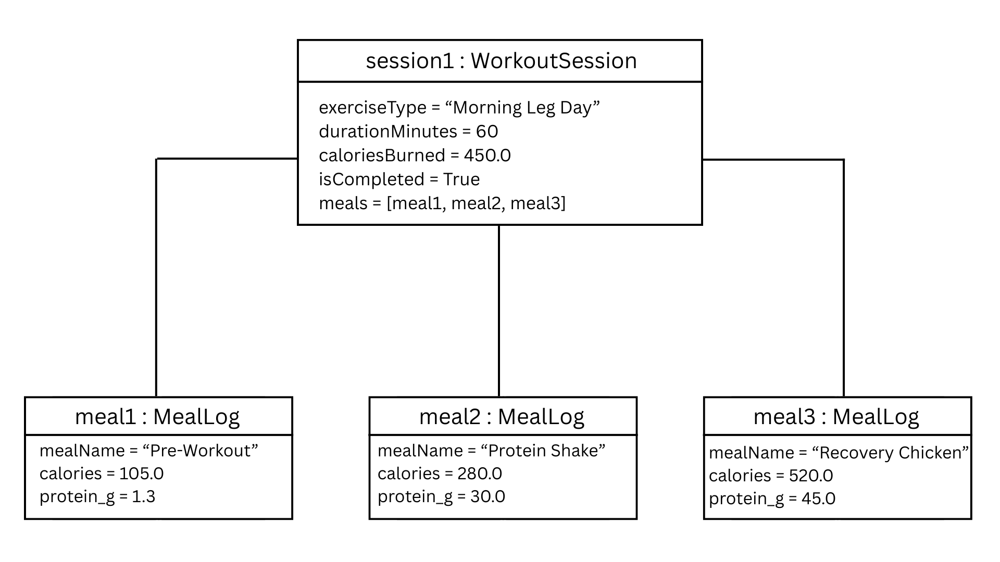
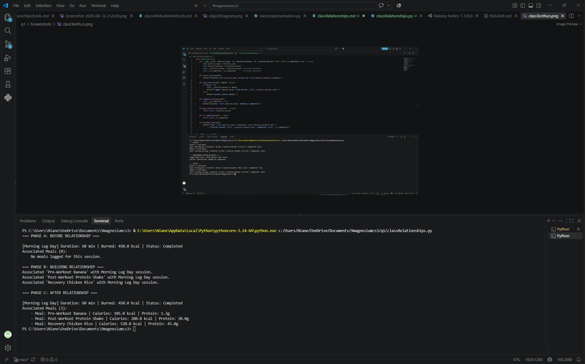

# Class Relationships: Association and Multiplicity
## Previous Work
[Part I - Classes and Objects](classObjectUML.md)
[Part II - Class Attributes and Methods](classAttributesMethods.md)

## Existing Class
Class: WorkoutSession
Description: This class represents a single fitness activity logged within a personal health application.

## New Related Class
Class: MealLog
Description: This class is built to observe food consumption and daily intake to maintain a personalized and healthy diet.

## Association
Relationship: WorkoutSession includes MealLog
Explanation: A WorkoutSession records all entry logs to track nutritional intake relevant to a specific training session.

## Multiplicity
Multiplicity: 1 to 0..*
Explanation: Directly one WorkoutSession can be affiliated with zero or more MealLog objects. It can start without any logs and accumulate pre-workout, intra-workout, or post-workout meals as user logs nutrition.

## UML Class Relationship Diagram

## Python Implementation
[View Python Source](classRelationships.py)

## Test Run

## Object Relationship Diagram

## Analysis

### What is the association between your two classes? 
For `WorkoutSession` and `MealLog`, The association between the two is a HAS-A relationship where a workout session contains nutritional logs. In our fitness tracking application, `WorkoutSession` acts as the primary container that manages related exercise data and recovery entries. This association links physical activity with energy consumption for a complete performance record.

### What multiplicity did you choose and why?
I personally picked a One-to-Many (1 to 0..*) multiplicity because a single `WorkoutSession` instance can be associated with zero or multiple `MealLog` instances. A session might begin with zero logged meals, but a user can associate a pre-workout snack or post-workout recovery meal as time passes. Each individual `MealLog` instance, however, belongs specifically to that one workout session context.

### How did you implement the relationship in Python?
The relationship is implemented by initializing an empty list named `self.meals` inside the `WorkoutSession` constructor. I created an `add_meal_log()` method in `WorkoutSession` that takes a `MealLog` object reference as an argument and appends it directly to `self.meals`.

### Why did you store an object reference instead of copying its data?
Storing ensures that `WorkoutSession` points to the actual live `MealLog` objects in memory rather than duplicate data. If a `MealLog` object's value are modified, accessing `session.meals` reflects those updates without manual sync. Storing references stops data redundancy and maintains consistency.

### If your relationship uses many, why is a list appropriate?
A list is appropriate because a One-to-Many relationship requires storing an ordered, dynamic, colection reference. In Python, a list allows `WorkoutSession` to dynamically append new `MealLog` instances as they are logged. It also enables iterating through each object using a loop to access object attributes and methods directly.