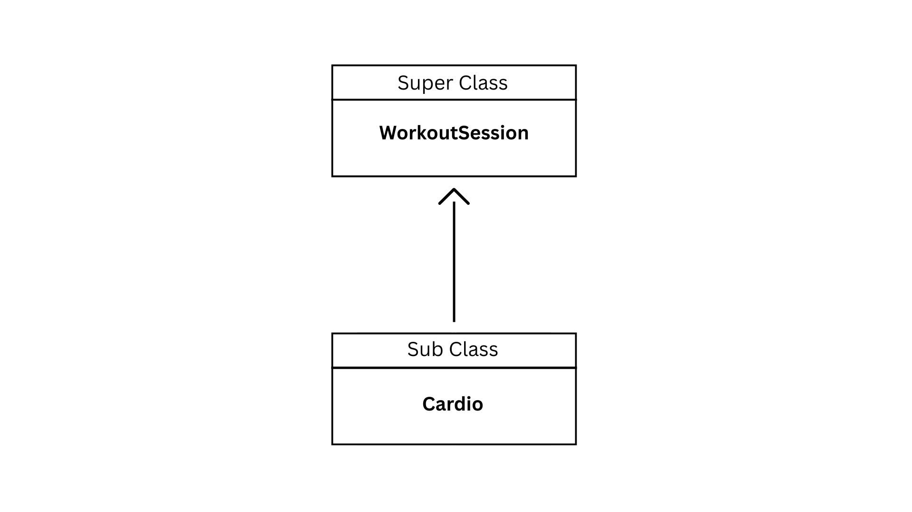
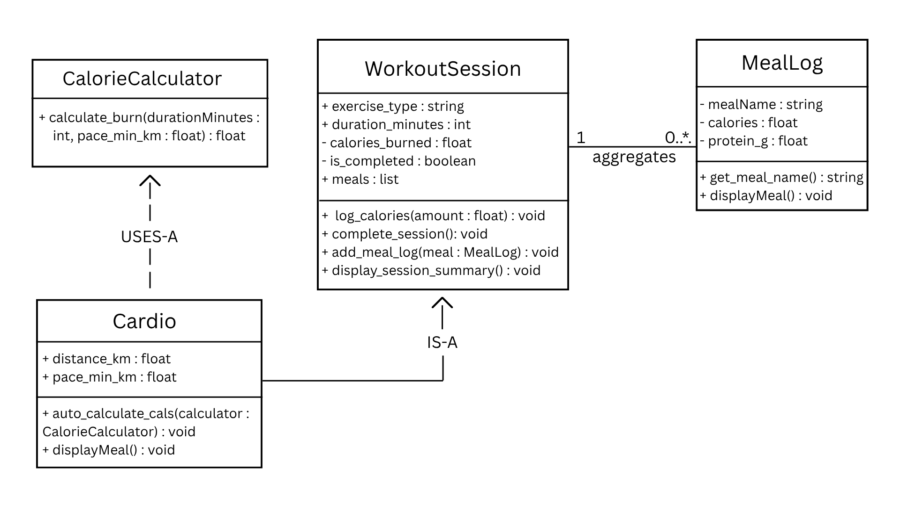
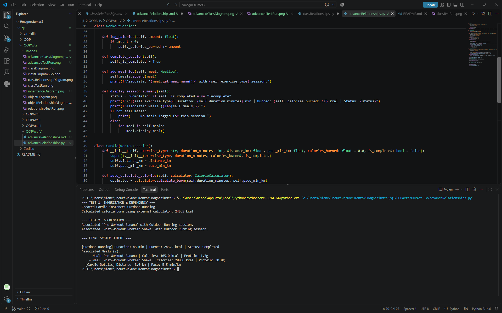
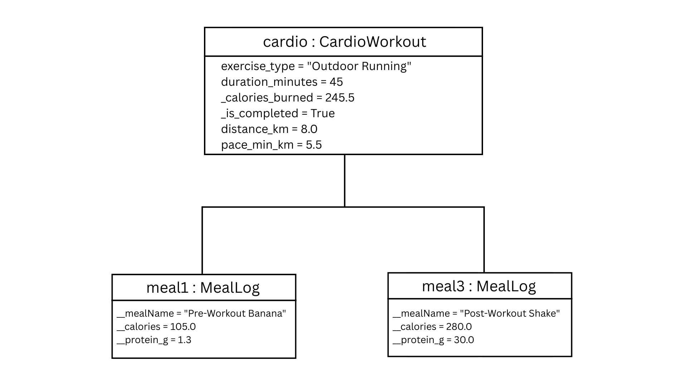

# Advanced Class Relationships

## Previous Activities

[classAttrib](<../OOPAct II/classAttributesMethods.md>)
[classRel](<../OOPAct III/classRelationships.md>)

## Existing System Description:
The existing system tracks your fitness activities and nutrient intake by entries or logs. However, it couldn't handle very specialized exercises without making mistakes.

## Inheritance Relationship

Parent: WorkoutSession
Child: Cardio
Explanation: `Cardio` IS-A specific type of `WorkoutSession`. It inherits all general session attributes and methods, while also adding specific stats like `distance_km`.

## Inheritance UML

## Composition/Aggregation

Relationship: Aggregation (Weak HAS-A)
Explanation: `WorkoutSession` HAS-A collection of `MealLog` objects. This is Aggregation rather than Composition because `MealLog` objects are inputted independently in memory before being passed into a `Cardio` instance. If a `Cardio` or `WorkoutSession` instance is deleted, the contained objects still exist independently in the system.

## Advanced UML Diagram

## Python Implementation

## Test Run

## Object Diagram

## Reflection

### 1. Why did you choose your inheritance relationship? Explain why your child class is a type of your parent class.
I chose `Cardio` as a sub class of `WorkoutSession` because cardio exercises share foundational fitness attributes while requiring specific distance and pace tracking parameters. `Cardio` IS-A specific type of `WorkoutSession`. It inherits all general session attributes and methods, while also adding specific stats like `distance_km`.

### 2. How did inheritance reduce duplicate code? Identify attributes or methods that were reused.
Inheritance eliminated the need to rewrite common attributes (`exercise_type`, `duration_minutes`, `_calories_burned`, `_is_completed`, `meals`) and core methods (`complete_session()`, `add_meal_log()`, `log_calories()`) inside `CardioWorkout`. By calling `super().__init__()`, the child class reuses the parent constructor and state management logic. Additionally, `Cardio` reuses the parent's summary display logic before adding cardio details.

### 3. Why is your HAS-A relationship Composition or Aggregation? Explain the lifecycle relationship between the two objects.
My HAS-A relationship is Aggregation because `MealLog` objects exist independently of `WorkoutSession`. In the fitness tracking application, meal entries are instantiated first and then linked to a session. The lifecycle of a `MealLog` is not bound to a `WorkoutSession` instance, meaning deleting a workout session won't destroy the meal logs.

### 4. What is the difference between Association from Part III and the advanced relationship you implemented?
The general Association in Part III represented a basic structural link where one class held references to another without strict lifecycle rules or code sharing. The advanced relationships in Part IV establish formal architectural rules of Inheritance, creating an IS-A class hierarchy with direct code reuse, Aggregation, explicitly defining weak ownership with independent lifecycles, and Dependency which represents a temporary USES-A relationship where an object uses a method of another class without storing it as an attribute.

### 5. How does your design follow the DRY principle?
The design follows the DRY (Don't Repeat Yourself) principle by centralizing all shared workout parameters and meal-management methods inside the `WorkoutSession` parent class. Subclasses like `Cardio` inherit this functionality directly instead of repeating code, and method overriding via `super().display_session_summary()` extends existing behavior without duplicating display logic from scratch.