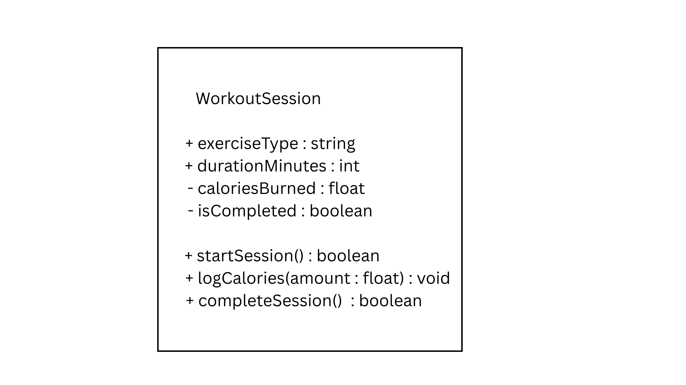
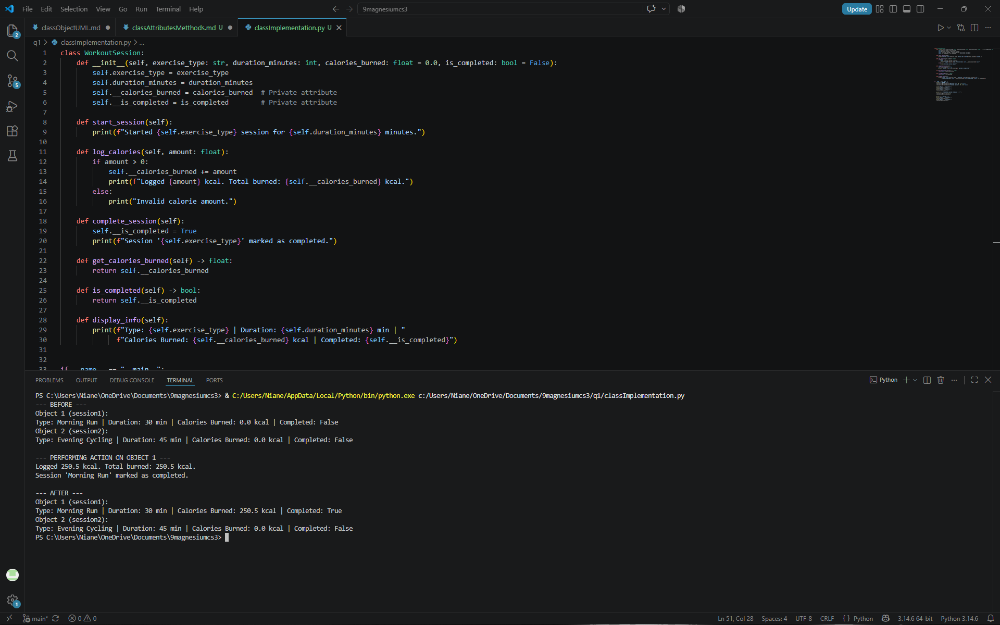
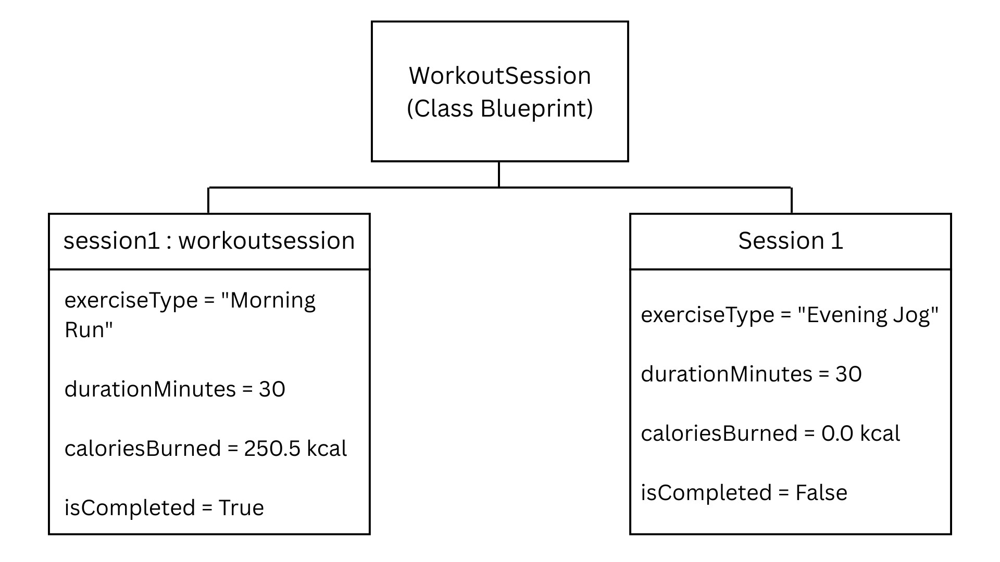

# Class Attributes and Methods

## Previous Design
Link to my previous activity:
[classObjectUML.md](classObjectUML.md)

## Design Revision
Changes from my previous design:
Updated attribute visibilities by making `caloriesBurned` and `isCompleted` private attributes to enforce data encapsulation. Added getter methods (`get_calories_burned()` and `is_completed()`) to allow safe external reading of private states.

## Visibility Decisions
| Attribute | Data Type | Visibility | Reason |
|---|---|---|---|
| `exerciseType` | `string` | Public | General descriptive label that can be read and edited directly without compromising internal calculations. |
| `durationMinutes` | `int` | Public | Planned session length that can be accessed or adjusted directly. |
| `caloriesBurned` | `double` | Private | Sensitive performance metric that must only be updated through controlled calculations (`logCalories`). |
| `isCompleted` | `boolean` | Private | Critical operational state that should only toggle when session completion steps are executed. |

## Updated UML Class Diagram

## Python Implementation
[View Python Source](classImplementation.py)

## Test Run

## Object Diagram

## Analysis

### Why did you make your chosen attribute private?
I made `caloriesBurned` and `isCompleted` private attributes to enforce data encapsulation and protect internal object state. If external code modified these attributes directly, negative values could be assigned to `caloriesBurned` or a session could be incorrectly marked as completed without proper verification. Encapsulating them ensures that data modifications occur only through validated method calls like `logCalories()`.

### Which method changes the state of your object?
The `logCalories(amount: double)` method changes the internal state of the `WorkoutSession` object. It directly targets the private `__calories_burned` attribute by adding the input parameter `amount` to the existing total. When executed, the object updates its stored energy expenditure value while leaving all other properties unchanged.

### How did your two objects demonstrate that instances are independent?
The test output demonstrated independence because executing `log_calories(250.5)` on `session1` increased its total calories burned to 250.5 kcal and updated its status to completed. Meanwhile, `session2` maintained its initial values of 0.0 kcal burned and `False` completion status. This confirms that each object instance maintains its own separate memory allocation and state.

### What is the difference between your class diagram and your object diagram?
The UML class diagram represents the abstract blueprint for `WorkoutSession`, defining all available attributes with their data types and accessible methods. In contrast, the object diagram shows specific runtime instances (`session1` and `session2`) at a particular moment in execution, populated with concrete values like `"Morning Run"` and `250.5`. The class diagram defines structure, whereas the object diagram captures actual state.