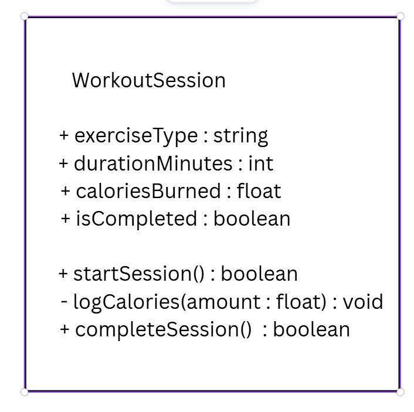

# SG4 - Understanding Classes and Objects

## Class Name
WorkoutSession

## Class Description
This class represents a single fitness activity logged within a personal health application.

## Properties
| Property | Data Type | Description |
|---|---|---|
| `exerciseType` | `string` | Name of physical exercise |
| `durationMinutes` | `int` | Total elapsed duration of the workout session in minutes |
| `caloriesBurned` | `double` | Total energy expenditure in kilocalories |
| `isCompleted` | `boolean` | Indicates whether workout session was completed |

## Methods
| Method | Description |
|---|---|
| `startSession()` | Starts timer tracking and active workout status |
| `logCalories(burned: double)` | Updates total energy expenditure during workout |
| `completeSession()` | Sets workout status to completed and finalizes session stats |

## Class Diagram

## Design Explanation

### Why did you choose this class?
I selected WorkoutSession because personal fitness tracking software relies heavily on modular data structures to capture individual activities. Designing an exercise session provides a clear mapping between daily physical activity and software objects.

### Which property is the most important? Why?
The `isCompleted` property is the most important due to its ability to prevent the skewing of overall activity analytics by filtering out incomplete or canceled workouts.

### Which method is the most useful? Why?
The `logCalories(burned: double)` method is the most essential because physical activity happens over time. It enables connected trackers like smartwatches to append active calorie burns continuously throughout the workout.